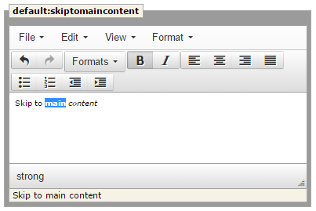

.. ==================================================
.. FOR YOUR INFORMATION
.. --------------------------------------------------
.. -*- coding: utf-8 -*- with BOM.

Insertion modes
---------------

LFEditor supports two ways of entering language constant values - via resizable text areas and via the tinyMCE extension.

resizable text areas
^^^^^^^^^^^^^^^^^^^^

This is the default insertion mode. If tinyMCE extension is not installed, this mode will be used.

TinyMCE
^^^^^^^

The extension contains the rich text editor “tinyMCE” that you can use for editing of the constants.

The tinyMCE extension can be downloaded `here <http://typo3.org/extensions/repository/view/tinymce/>`_.